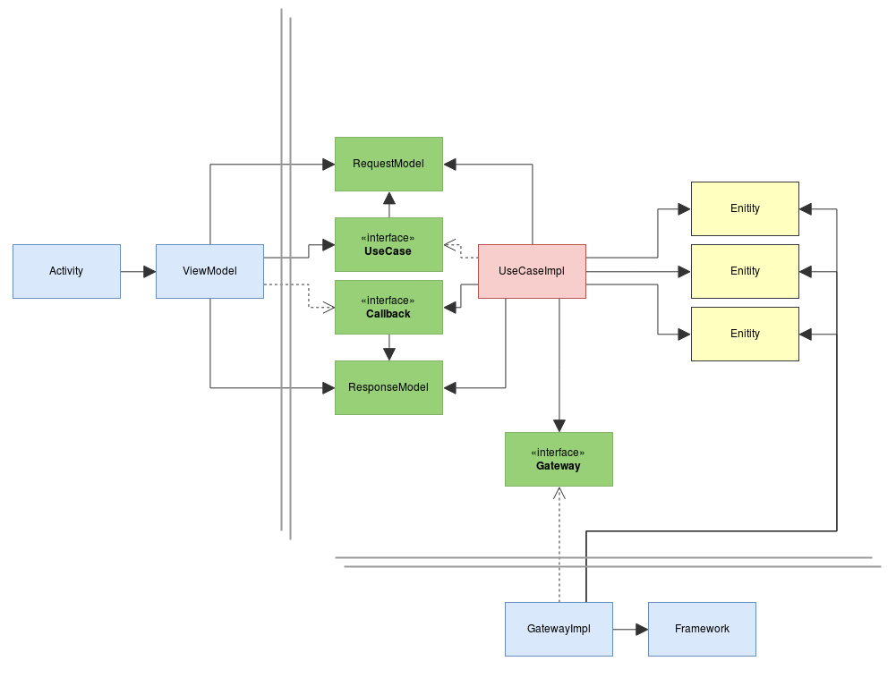

Android Architecture
====================

[](https://travis-ci.org/GianpaMX/android-architecture)
[](https://codecov.io/gh/GianpaMX/android-architecture)

This is a project to show how to separate an app into several layers. Following
[Uncle Bob Clean Architecture](https://8thlight.com/blog/uncle-bob/2012/08/13/the-clean-architecture.html).



All App code is in
[app/src/main/java/io/github/gianpamx/android/architecture](app/src/main/java/io/github/gianpamx/android/architecture)
and is organized in a way when you read the directory list you get an app, data, entities, form,
gallery, providers and usecase. The idea is to know where the files are so, if you want to modify
the gallery everything should be in there

- **[form](app/src/main/java/io/github/gianpamx/android/architecture/form)**: Form feature, when the
  app starts it should show a form for introducing a name and a phone. It should display the current
  time updated every second. If the form was already filled, it should start gallery directly.
  Classes in here shouldn't be used outside

- **[gallery](app/src/main/java/io/github/gianpamx/android/architecture/gallery)**: Gallery feature,
  there should be a greeting message to the named introduced in the form and a grid of images with
  smooth scrolling. Classes in here shouldn't be used outside

- **[usecase](app/src/main/java/io/github/gianpamx/android/architecture/usecase)**: Center of the
  business rules. All the rules of what the app can do are here. Are constructed in a way that can
  be reused across all features

- **[entity](app/src/main/java/io/github/gianpamx/android/architecture/entity)**: Center of the
  application; here there are models that holds information of what the app does

- **[data](app/src/main/java/io/github/gianpamx/android/architecture/data)**: Data handling like
  downloading images and storing into a database

- **[providers](app/src/main/java/io/github/gianpamx/android/architecture/providers)**: Provide
  information from app like version or from system like current time

- **[app](app/src/main/java/io/github/gianpamx/android/architecture/app)**: Android Application
  class and everything that is instantiated with an app scope and should be available from anywhere

This project is build using `Model-View-ViewModel` basically ViewModel substitutes Presenter in (MVP)
so the View (activities) only interact with UseCases using the ViewModel. The view is subscribed to
ViewModel changes and react to them. ViewModels should be ready to display, no complex
transformations or logic here (rather than view logic)

ViewModels are the bridge between Views and UseCases, they map request from the view into requests
to one or many UseCases.

UseCases are the business logic of the app, they abstract what the app does in terms of
`input -> UseCase -> output`. They request data to Gateways or from providers, manipulates them
according to a business rules.


## Testing

There are two kind of tests in this project, instrumented tests and unit tests. They test different
things.

Instrumented Tests verify that view behaves according to business rules putting in place all
the components of the app but data or providers that are mocked to create different scenarios.

Uni Tests check all possible scenarios of each class except view classes, here we test if thay
are behaving as expected

To run all tests:
```
./gradlew fullCoverageReport
```
